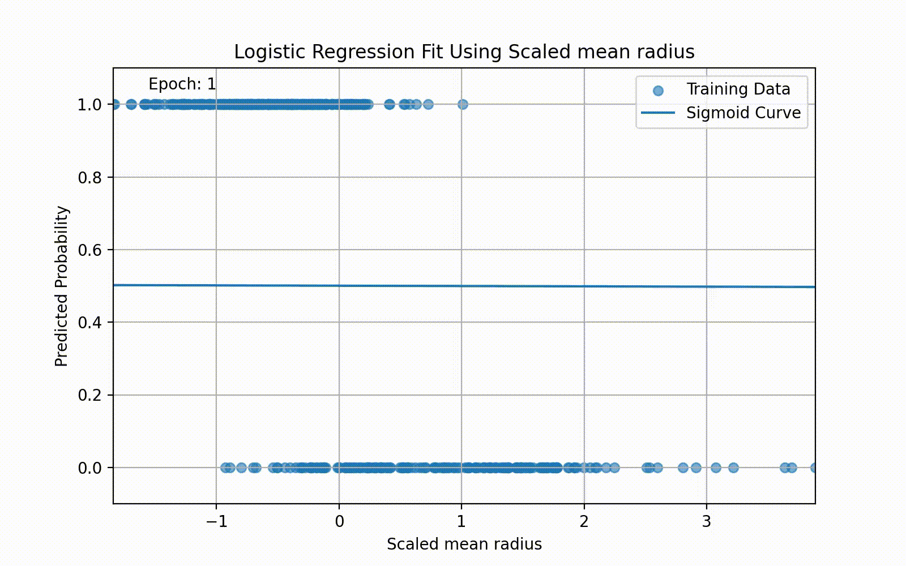
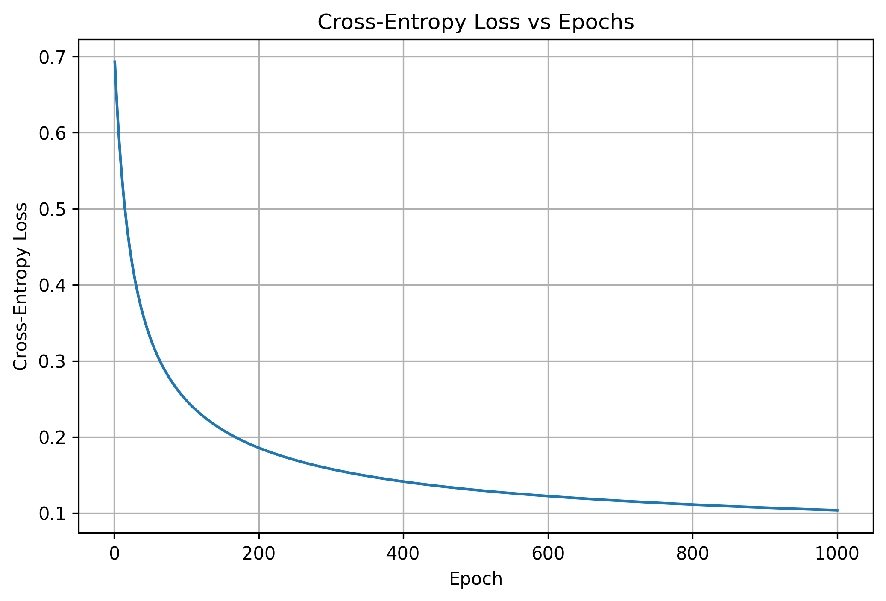
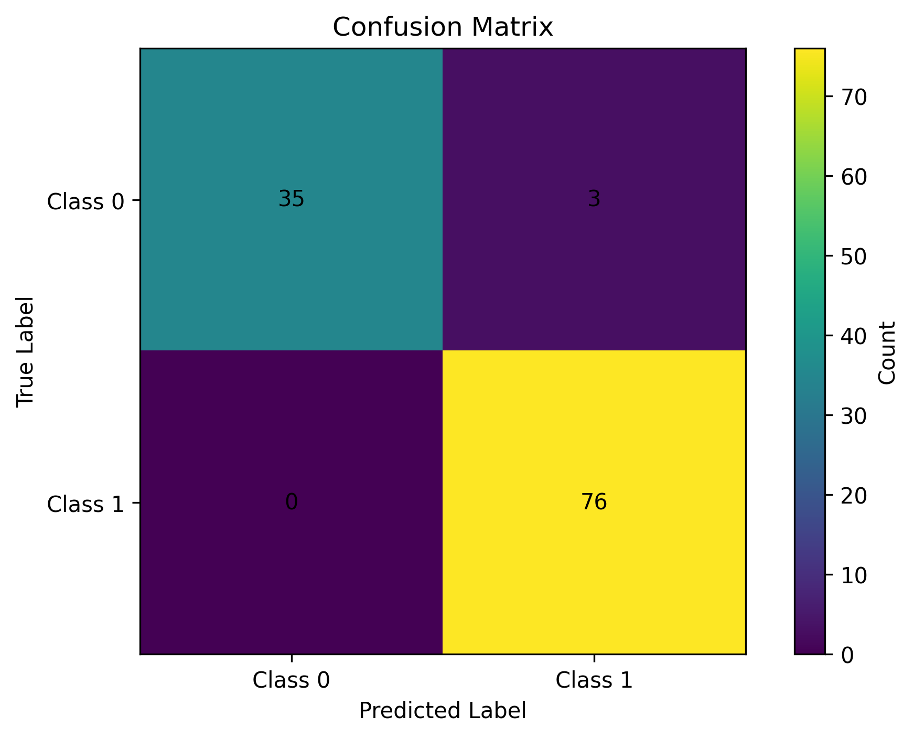
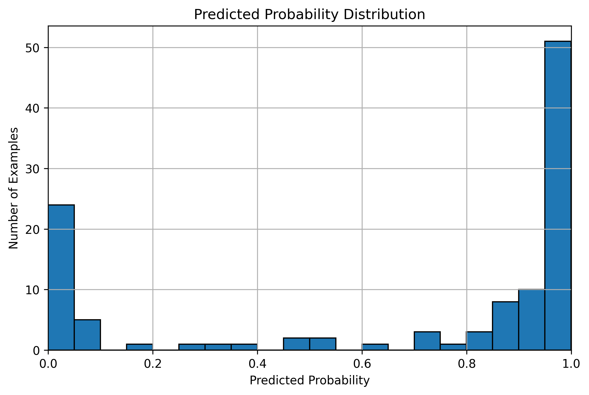

# Cancer Logistic Regression From Scratch

A from-scratch implementation of logistic regression in Python using NumPy, tested on Scikit-Learn’s breast cancer classification dataset.

This project demonstrates how logistic regression works internally by manually implementing the sigmoid function, cross-entropy loss, gradient descent, parameter updates, probability prediction, and binary classification.

I also created a detailed guide explaining how I implemented the model, including the mathematical theory behind logistic regression and how it works under the hood. Improvements to the document are welcome.

[Read more about the theory and implementation guide](#theory-and-implementation-guide)

## Results

The model achieved strong performance on the breast cancer classification dataset.

```text
Train Accuracy: 0.9758
Test Accuracy: 0.9737
```

## Visual Preview

### Sigmoid Training Animation

This animation shows a separate one-feature logistic regression model learning a sigmoid curve over time.



The animation visualises how the sigmoid curve changes as the model updates its parameters during training.

### Cross-Entropy Loss vs Epochs



This graph shows the cross-entropy loss decreasing over time, indicating that gradient descent is improving the model.

### Confusion Matrix



The confusion matrix shows how many test examples were correctly and incorrectly classified by the model.

### Predicted Probability Distribution



This histogram shows the distribution of predicted probabilities, helping show how confident the model is in its predictions.

## Dataset

This project uses [Scikit-Learn’s built-in Breast Cancer Wisconsin dataset](https://scikit-learn.org/stable/modules/generated/sklearn.datasets.load_breast_cancer.html).

The dataset contains numerical measurements computed from images of breast cancer cell nuclei. These features describe characteristics such as radius, texture, perimeter, area, smoothness, compactness, concavity, and concave points.

The goal is to use these features to classify each sample into one of two classes.

This dataset is suitable for logistic regression because it is a binary classification problem and all features are numerical, making it a good dataset for implementing and testing logistic regression from scratch.

## Theory and Implementation Guide

I created a detailed guide that explains the theory behind logistic regression and how the model was implemented from scratch. I used this guide to build my understanding of how logistic regression works and to support the implementation of my own model.

The guide covers:

- the intuition behind logistic regression
- the sigmoid function
- prediction probabilities
- the likelihood function
- cross-entropy loss
- gradient descent
- the gradient calculation
- the Python implementation
- testing the model on the breast cancer dataset

[Open the full guide](assets/Logistic-Regression.pdf)

## Project Structure

```text
Cancer-Logistic-Regression-From-Scratch/
│
├── assets/
│   ├── confusion-matrix.png
│   ├── cross-entropy-loss-vs-epochs.png
│   ├── Logistic-Regression.pdf
│   ├── predicted-probability-distribution.png
│   ├── sigmoid_training_fit.mp4
│   └── sigmoid-training-fit.gif
│
├── data/
│   └── eda.ipynb
│
├── src/
│   ├── __init__.py
│   ├── fit.py
│   ├── plots.py
│   └── test.py
│
├── .gitignore
├── main.py
├── README.md
└── requirements.txt
```

## Running the Project

Clone the repository:

```bash
git clone https://github.com/jacksonjgee/Cancer-Logistic-Regression-From-Scratch.git
````

Move into the project folder:

```bash
cd Cancer-Logistic-Regression-From-Scratch
```

Create and activate a virtual environment:

```bash
python3 -m venv .venv
source .venv/bin/activate
```

Install the required Python packages:

```bash
pip install -r requirements.txt
```

Install FFmpeg for the sigmoid training animation:

```bash
brew install ffmpeg
```

Run the project:

```bash
python3 main.py
```

The project will train the logistic regression model, print the train and test accuracy, and generate the visualisations in the `assets/` folder.